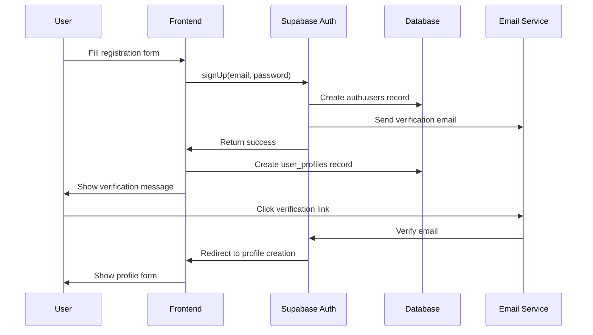
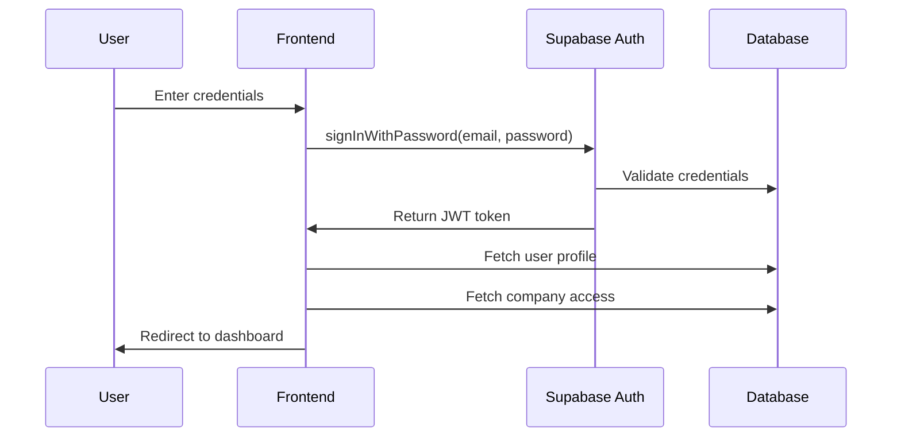

# Architecture Document
**Version:** v4  
**Date:** 2024-12-19  
**System:** Waste Intelligence Platform - Authentication & User Management

## 1. System Overview

### 1.1 Architecture Pattern
The authentication system follows a **layered architecture** pattern with clear separation of concerns:

- **Presentation Layer:** React/Next.js with shadcn UI components
- **Business Logic Layer:** Authentication services and user management
- **Data Access Layer:** Supabase client and database operations
- **External Services Layer:** Email service, file storage

### 1.2 Technology Stack
- **Frontend:** React 18, Next.js 14, TypeScript
- **UI Components:** shadcn/ui v4, Tailwind CSS
- **Backend:** Supabase (PostgreSQL, Auth, Storage)
- **Authentication:** Supabase Auth with JWT tokens
- **Database:** PostgreSQL with Row Level Security (RLS)
- **File Storage:** Supabase Storage
- **Email:** Supabase Auth email service

## 2. System Architecture

### 2.1 High-Level Architecture
```
┌─────────────────┐    ┌─────────────────┐    ┌─────────────────┐
│   Frontend      │    │   Supabase      │    │   External      │
│   (Next.js)     │◄──►│   Backend       │◄──►│   Services      │
│                 │    │                 │    │                 │
│ • Auth Forms    │    │ • Auth Service  │    │ • Email Service │
│ • Dashboard     │    │ • Database      │    │ • File Storage  │
│ • Profile Mgmt  │    │ • Storage       │    │                 │
└─────────────────┘    └─────────────────┘    └─────────────────┘
```

### 2.2 Component Architecture
```
src/
├── components/
│   ├── auth/
│   │   ├── LoginForm.tsx
│   │   ├── RegisterForm.tsx
│   │   ├── PasswordResetForm.tsx
│   │   └── AuthProvider.tsx
│   ├── profile/
│   │   ├── ProfileForm.tsx
│   │   ├── ProfilePicture.tsx
│   │   └── ProfileSettings.tsx
│   ├── company/
│   │   ├── CompanySelector.tsx
│   │   ├── UserManagement.tsx
│   │   └── AccessControl.tsx
│   └── dashboard/
│       ├── DashboardLayout.tsx
│       ├── UserOverview.tsx
│       └── QuickActions.tsx
├── lib/
│   ├── supabase.ts
│   ├── auth.ts
│   ├── user.ts
│   └── company.ts
├── hooks/
│   ├── useAuth.ts
│   ├── useUser.ts
│   └── useCompany.ts
└── types/
    ├── auth.ts
    ├── user.ts
    └── company.ts
```

## 3. Database Design

### 3.1 Core Tables

#### 3.1.1 User Profiles (`user_profiles`)
```sql
CREATE TABLE user_profiles (
    id UUID PRIMARY KEY REFERENCES auth.users(id),
    email TEXT NOT NULL,
    username TEXT UNIQUE NOT NULL,
    full_name TEXT,
    role TEXT DEFAULT 'user' CHECK (role IN ('user', 'admin', 'company_admin')),
    is_active BOOLEAN DEFAULT true,
    email_verified BOOLEAN DEFAULT false,
    created_at TIMESTAMPTZ DEFAULT now(),
    updated_at TIMESTAMPTZ DEFAULT now()
);
```

#### 3.1.2 Company Access (`user_company_access`)
```sql
CREATE TABLE user_company_access (
    id UUID PRIMARY KEY DEFAULT gen_random_uuid(),
    user_id UUID REFERENCES user_profiles(id),
    company_id TEXT REFERENCES companies(id),
    access_level TEXT CHECK (access_level IN ('owner', 'admin', 'analyst', 'viewer')),
    granted_by UUID REFERENCES user_profiles(id),
    granted_at TIMESTAMPTZ DEFAULT now(),
    expires_at TIMESTAMPTZ,
    is_active BOOLEAN DEFAULT true
);
```

#### 3.1.3 Audit Logs (`audit_logs`)
```sql
CREATE TABLE audit_logs (
    id UUID PRIMARY KEY DEFAULT gen_random_uuid(),
    user_id UUID REFERENCES user_profiles(id),
    company_id TEXT REFERENCES companies(id),
    action TEXT NOT NULL,
    table_name TEXT NOT NULL,
    record_id TEXT,
    old_values JSONB,
    new_values JSONB,
    ip_address INET,
    user_agent TEXT,
    created_at TIMESTAMPTZ DEFAULT now()
);
```

### 3.2 Row Level Security (RLS)
```sql
-- User profiles can only be accessed by the user themselves or company admins
CREATE POLICY "Users can view own profile" ON user_profiles
    FOR SELECT USING (auth.uid() = id);

CREATE POLICY "Company admins can view team profiles" ON user_profiles
    FOR SELECT USING (
        EXISTS (
            SELECT 1 FROM user_company_access uca
            WHERE uca.user_id = auth.uid()
            AND uca.access_level IN ('admin', 'owner')
            AND uca.is_active = true
        )
    );

-- Company access is restricted to company members
CREATE POLICY "Company members can view access" ON user_company_access
    FOR SELECT USING (
        user_id = auth.uid() OR
        EXISTS (
            SELECT 1 FROM user_company_access uca
            WHERE uca.user_id = auth.uid()
            AND uca.company_id = user_company_access.company_id
            AND uca.access_level IN ('admin', 'owner')
            AND uca.is_active = true
        )
    );
```

## 4. Authentication Flow

### 4.1 Registration Flow


### 4.2 Login Flow


## 5. Security Architecture

### 5.1 Authentication Security
- **JWT Tokens:** Secure, stateless authentication
- **Password Hashing:** bcrypt with salt rounds
- **Rate Limiting:** Prevents brute force attacks
- **Session Management:** Configurable session timeouts
- **Email Verification:** Required for account activation

### 5.2 Authorization Security
- **Row Level Security:** Database-level access control
- **Role-Based Access:** Granular permission system
- **Company Isolation:** Users can only access their company data
- **Audit Logging:** Complete action tracking
- **Input Validation:** Server-side validation for all inputs

### 5.3 Data Security
- **HTTPS Only:** All communications encrypted
- **SQL Injection Prevention:** Parameterized queries
- **XSS Protection:** Input sanitization
- **CSRF Protection:** Token-based validation
- **File Upload Security:** Type and size validation

## 6. API Design

### 6.1 Authentication Endpoints
```typescript
// Supabase Auth methods
interface AuthAPI {
  signUp(email: string, password: string): Promise<AuthResponse>
  signInWithPassword(email: string, password: string): Promise<AuthResponse>
  signOut(): Promise<void>
  resetPasswordForEmail(email: string): Promise<void>
  updateUser(updates: UserUpdate): Promise<AuthResponse>
}
```

### 6.2 User Management Endpoints
```typescript
// Custom user management functions
interface UserAPI {
  createProfile(profile: UserProfile): Promise<UserProfile>
  updateProfile(id: string, updates: Partial<UserProfile>): Promise<UserProfile>
  getUserProfile(id: string): Promise<UserProfile>
  getCompanyUsers(companyId: string): Promise<UserProfile[]>
  updateUserAccess(userId: string, access: UserAccess): Promise<void>
}
```

## 7. Component Design

### 7.1 Authentication Components
```typescript
// LoginForm component
interface LoginFormProps {
  onSuccess: (user: User) => void
  onError: (error: string) => void
}

const LoginForm: React.FC<LoginFormProps> = ({ onSuccess, onError }) => {
  // Implementation with shadcn UI components
}
```

### 7.2 Profile Management Components
```typescript
// ProfileForm component
interface ProfileFormProps {
  user: User
  onUpdate: (updates: Partial<UserProfile>) => Promise<void>
  companies: Company[]
}

const ProfileForm: React.FC<ProfileFormProps> = ({ user, onUpdate, companies }) => {
  // Implementation with form validation
}
```

## 8. State Management

### 8.1 Authentication State
```typescript
interface AuthState {
  user: User | null
  loading: boolean
  error: string | null
}

const useAuth = () => {
  // Authentication state management
  // User session handling
  // Login/logout functions
}
```

### 8.2 User State
```typescript
interface UserState {
  profile: UserProfile | null
  company: Company | null
  accessLevel: AccessLevel
  loading: boolean
}

const useUser = () => {
  // User profile management
  // Company access handling
  // Profile update functions
}
```

## 9. Error Handling

### 9.1 Error Types
- **Authentication Errors:** Invalid credentials, expired tokens
- **Validation Errors:** Form validation failures
- **Permission Errors:** Insufficient access rights
- **Network Errors:** Connection failures
- **Server Errors:** Backend service failures

### 9.2 Error Handling Strategy
- **User-Friendly Messages:** Clear, actionable error messages
- **Error Boundaries:** React error boundaries for component errors
- **Retry Logic:** Automatic retry for transient failures
- **Logging:** Comprehensive error logging for debugging
- **Fallback UI:** Graceful degradation for errors

## 10. Performance Considerations

### 10.1 Frontend Performance
- **Code Splitting:** Lazy loading of authentication components
- **Memoization:** React.memo for expensive components
- **Virtual Scrolling:** For large user lists
- **Image Optimization:** Optimized profile pictures
- **Caching:** Local storage for user preferences

### 10.2 Backend Performance
- **Database Indexing:** Optimized queries for user lookups
- **Connection Pooling:** Efficient database connections
- **Caching:** Redis for session data
- **CDN:** Static asset delivery
- **Query Optimization:** Efficient data fetching

## 11. Monitoring and Logging

### 11.1 Application Monitoring
- **User Metrics:** Registration, login, profile completion rates
- **Performance Metrics:** Response times, error rates
- **Security Metrics:** Failed login attempts, suspicious activity
- **Business Metrics:** User engagement, feature usage

### 11.2 Audit Logging
- **User Actions:** All user actions logged with context
- **System Events:** Authentication, authorization events
- **Data Changes:** Profile updates, access changes
- **Security Events:** Failed attempts, permission denials

## 12. Deployment Architecture

### 12.1 Frontend Deployment
- **Platform:** Vercel or Netlify
- **Build Process:** Next.js static generation
- **CDN:** Global content delivery
- **Environment Variables:** Secure configuration

### 12.2 Backend Deployment
- **Platform:** Supabase (managed)
- **Database:** PostgreSQL with RLS
- **Storage:** Supabase Storage
- **Monitoring:** Supabase dashboard + custom metrics

## 13. Development Guidelines

### 13.1 Code Standards
- **TypeScript:** Strict type checking
- **ESLint:** Code quality enforcement
- **Prettier:** Code formatting
- **Husky:** Pre-commit hooks
- **Testing:** Jest + React Testing Library

### 13.2 Component Standards
- **shadcn UI:** Consistent component usage
- **Accessibility:** WCAG 2.1 compliance
- **Responsive Design:** Mobile-first approach
- **Error Handling:** Comprehensive error states
- **Loading States:** User feedback during operations

---

**Document Status:** Draft  
**Next Review:** 2024-12-26  
**Maintained By:** Development Team  
**Approved By:** [To be filled]
